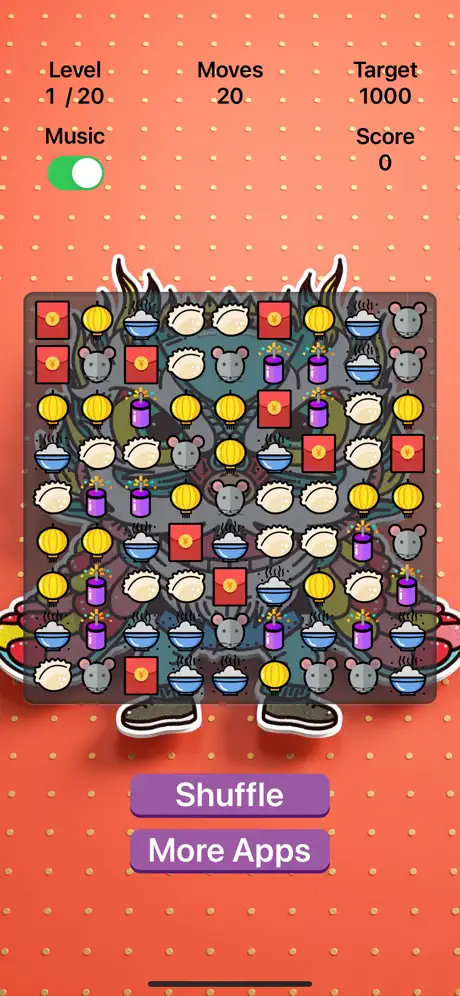

# Spring Festival Crush - Match 3

## Overview

**Spring Festival Crush - Match 3** is an exciting and colorful match-3 puzzle game that immerses players in the festive spirit of the Spring Festival. With a wide range of levels, and beautifully designed graphics, this game is perfect for fans of match-3 puzzles looking for a fresh and thematic challenge.

## Features

- **Festive Theme**: Celebrate the Spring Festival with beautifully designed levels and festive elements.
- **Challenging Levels**: Many levels to keep you engaged with increasing difficulty.
- **Smooth Gameplay**: Enjoy a seamless gaming experience with smooth animations and intuitive controls.

## Screenshots

## Installation

### iOS

The game is available for download on the App Store. Click the link below to download:

### Requirements

- **iOS Version**: iOS 17.0 or later
- **Compatible Devices**: iPhone, iPad, and Mac

## How to Play

1. **Match 3 or More**: Swipe to match three or more identical elements in a row.
2. **Complete Objectives**: Achieve the objectives set for each level within the given moves or time.
3. **Advance Through Levels**: Progress through increasingly difficult levels and enjoy new challenges.

## Development

### Tech Stack

- **Language**: Swift
- **Framework**: SpriteKit, SwiftUI, Swift Concurrency, SwiftData
- **Ad Integration**: Google AdMob

### Contributing

We welcome contributions to the project! Please feel free to submit a pull request or open an issue if you have suggestions or find bugs.

---

**Spring Festival Crush - Match 3** © 2024 by Appsbay. All rights reserved.
