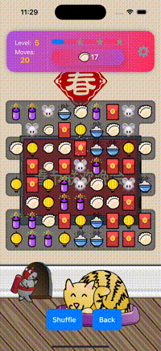
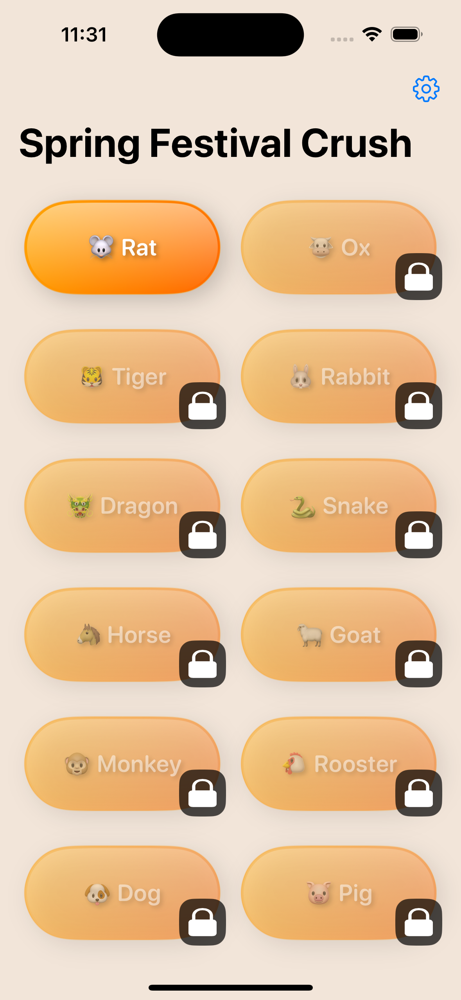

# Spring Festival Crush - Match 3

[](https://apps.apple.com/tw/app/spring-festival-crush-match-3/id1495828131?l=en)

## Overview

**Spring Festival Crush - Match 3** is a vibrant match-3 puzzle game that captures the essence of the Spring Festival. Immerse yourself in a world filled with festive joy, challenging puzzles, and stunning graphics that celebrate the season.

## Features

* 🎉 **Festive Theme**: Dive into the spirit of the Spring Festival with themed levels and elements that bring the celebration to life.

* 🧩 **Challenging Gameplay**: Overcome a variety of levels that increase in difficulty, offering endless fun and a test of your puzzle-solving skills.

* ⚡ **Smooth Experience**: Enjoy fluid animations and intuitive controls for a seamless gaming experience.

## Screenshots

<p align="center">
    
    
    
</p>

## 🧳 Requirements

- **iOS Version**: iOS 17.0 or later
- **Compatible Devices**: iPhone, iPad
- Swift 5+

## 💻 Installation

### iOS

The game is available for download on the App Store. Click the link below to download:

[](https://apps.apple.com/tw/app/spring-festival-crush-match-3/id1495828131?l=en)


### Local Development

1. Clone the repository:

   ```
   git clone https://github.com/banghuazhao/Spring-Festival-Crush.git
   ```

2. Open the project in Xcode.

3. Build and run the project on your device or simulator.

## How to Play

1. **Match 3 or More**: Swipe to match three or more identical elements in a row to clear them from the board.
2. **Complete Objectives**: Meet the goals for each level within the allotted moves or time limit.
3. **Progress Through Levels**: Advance through increasingly difficult levels and unlock new challenges as you go.

## Development

### Tech Stack

- **Language**: Swift
- **Framework**: SpriteKit, SwiftUI, Swift Concurrency, SwiftData
- **Ad Integration**: Google AdMob

### Contributing

We welcome contributions to the project! Please feel free to submit a pull request or open an issue if you have suggestions or find bugs.

---

© 2019 - 2024 **Spring Festival Crush - Match 3** by Appsbay. All rights reserved.
