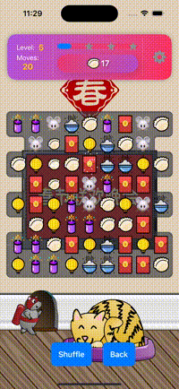
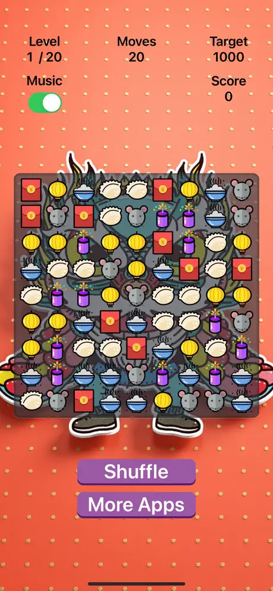
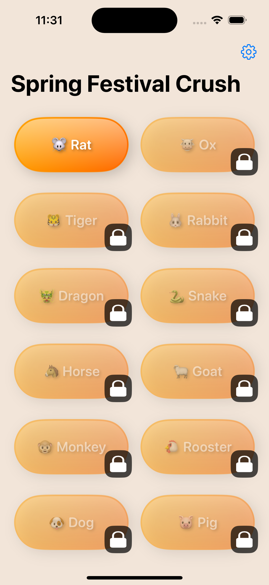

# Spring Festival Crush - Match 3

[](https://apps.apple.com/app/spring-festival-crush-match-3/id1495828131)
[](https://swift.org)
[](https://developer.apple.com/ios/)
[](LICENSE.md)

## 🎮 Demo

<p align="center">
    
</p>

## Overview

**Spring Festival Crush - Match 3** is a vibrant match-3 puzzle game that captures the essence of the Spring Festival. Immerse yourself in a world filled with festive joy, challenging puzzles, and stunning graphics that celebrate the season.

## ✨ Features

* 🎉 **Festive Theme**: Dive into the spirit of the Spring Festival with themed levels and elements that bring the celebration to life.
* 🧩 **Challenging Gameplay**: Overcome a variety of levels that increase in difficulty, offering endless fun and a test of your puzzle-solving skills.
* ⚡ **Smooth Experience**: Enjoy fluid animations and intuitive controls for a seamless gaming experience.
* 🎵 **Immersive Audio**: Experience traditional Chinese music and sound effects that enhance the festive atmosphere.
* 🌟 **Multiple Zodiac Themes**: Play through different Chinese zodiac animal themes with unique challenges.
* 📊 **Progress Tracking**: Save your progress and track your achievements across all levels.
* 💥 **Special Power-Up Tiles**: Earn powerful tiles through skillful matches for explosive chain reactions.

## 📱 Screenshots

<p align="center">
    
    
    
</p>

## 🧳 Requirements

- **iOS Version**: iOS 17.0 or later
- **Compatible Devices**: iPhone, iPad
- **Xcode**: 15.0 or later
- **Swift**: 5.0+

## 💻 Installation

### iOS App Store

The game is available for download on the App Store. Click the link below to download:

[](https://apps.apple.com/app/spring-festival-crush-match-3/id1495828131)

### Local Development

1. **Clone the repository**:
   ```bash
   git clone https://github.com/banghuazhao/Spring-Festival-Crush.git
   cd Spring-Festival-Crush
   ```

2. **Open the project**:
   - Open `SpringFestivalCrush.xcodeproj` in Xcode
   - Select your target device or simulator

3. **Build and run**:
   - Press `Cmd + R` to build and run the project
   - Or click the "Play" button in Xcode

## 🎯 How to Play

1. **Match 3 or More**: Swipe to match three or more identical elements in a row to clear them from the board.
2. **Complete Objectives**: Meet the goals for each level within the allotted moves or time limit.
3. **Progress Through Levels**: Advance through increasingly difficult levels and unlock new challenges as you go.
4. **Unlock Zodiac Themes**: Complete levels to unlock different Chinese zodiac animal themes.

### 💥 Special Tiles

| Match | Tile | Effect |
|-------|------|--------|
| 4 in a row | 💥 Enhanced | Explodes all surrounding tiles with a shockwave |
| 5 in a row | 🌟 Universal (Five) | Swap with any tile to clear **every** tile of that type on the board |
| L / T shape | ⚡ Lightning | Clears the entire row **and** column instantly |
| 🔒 Lock | Lock | Requires an adjacent match to break free |
| ⛓️ Heavy Lock | Heavy Lock | Takes two adjacent matches to remove |

Special tiles can be swapped directly to trigger their effect at any time.

## 🏗️ Project Structure

```
SpringFestivalCrush/
├── Model/                 # Data models and game logic
│   ├── Game/             # Core game mechanics
│   ├── Level/            # Level data and objectives
│   ├── Music/            # Audio management
│   ├── Record/           # Progress tracking
│   └── Settings/         # App settings and themes
├── Scene/                # SpriteKit game scenes
├── View/                 # SwiftUI views and UI components
├── Assets.xcassets/      # Images and app icons
├── Sounds/               # Audio files
├── Levels/               # Level configuration files
└── Util/                 # Utility classes and extensions
```

## 🛠️ Development

### Tech Stack

- **Language**: Swift 5.0+
- **Game Framework**: SpriteKit
- **UI Framework**: SwiftUI
- **Concurrency**: Swift Concurrency (async/await)
- **Data Persistence**: SwiftData
- **Ad Integration**: Google AdMob
- **Build System**: Xcode

### Key Features

- **Modern Swift**: Leverages the latest Swift features including async/await and SwiftData
- **Performance Optimized**: Efficient memory management and smooth 60fps gameplay
- **Accessibility**: Supports VoiceOver and other accessibility features
- **Localization**: Available in English, Simplified Chinese, and Traditional Chinese

## 📋 Release Notes

### Version 3.0 (Latest)
- 🌟 New **Universal (Five)** power-up tile: match 5 in a row to earn it, then swap to clear every tile of one type
- ⚡ New **Lightning** power-up tile: formed from L/T-shape matches, clears an entire row and column at once
- 💥 **Double-lock** tile mechanic: heavy locks require two adjacent matches to break
- 🎨 Distinct activation effects for each power-up (shockwave ring, beam chain-link pull, yellow flash bar)
- 🐾 **Tiger** zodiac: 10 new levels added
- 📈 **Rat** and **Ox** zodiacs extended to 15 levels each
- 🐛 Fixed selection indicator showing a broken-image cross on emoji-rendered tiles
- 🔧 Enhanced tile now spawns at the exact position of the swapped tile

### Version 2.0
- ✨ Enhanced graphics and animations
- 🎵 Improved audio experience with traditional Chinese music
- 🌟 Added new zodiac themes and levels
- 📊 Better progress tracking and achievements
- 🐛 Bug fixes and performance improvements

### Version 1.0
- 🎮 Initial release with core match-3 gameplay
- 🎨 Spring Festival themed graphics and elements
- 📱 Support for iPhone and iPad

## 🤝 Contributing

We welcome contributions to the project! Here's how you can help:

1. **Fork the repository**
2. **Create a feature branch**: `git checkout -b feature/amazing-feature`
3. **Commit your changes**: `git commit -m 'Add some amazing feature'`
4. **Push to the branch**: `git push origin feature/amazing-feature`
5. **Open a Pull Request**

### Development Guidelines

- Follow Swift style guidelines
- Add comments for complex logic
- Test on both iPhone and iPad
- Ensure accessibility compliance

## 🐛 Issues & Support

If you encounter any bugs or have suggestions:

- **GitHub Issues**: [Open an issue](https://github.com/banghuazhao/Spring-Festival-Crush/issues)
- **App Store Reviews**: Leave a review on the App Store
- **Email Support**: Contact us through the app settings

## 📞 Contact

Get in touch with us:

- **GitHub**: [@banghuazhao](https://github.com/banghuazhao)
- **App Store**: [Spring Festival Crush - Match 3](https://apps.apple.com/app/spring-festival-crush-match-3/id1495828131)
- **Email**: Contact through the app settings
- **Website**: [GitHub Repository](https://github.com/banghuazhao/Spring-Festival-Crush)

For business inquiries or collaboration opportunities, please reach out through GitHub or the app.

## 📄 License

This project is licensed under the MIT License - see the [LICENSE.md](LICENSE.md) file for details.

## 🙏 Acknowledgments

- Traditional Chinese music and sound effects
- Spring Festival cultural elements and themes
- The SpriteKit and SwiftUI communities
- All beta testers and contributors

---

© 2019 - 2026 **Spring Festival Crush - Match 3** by Appsbay. All rights reserved.
