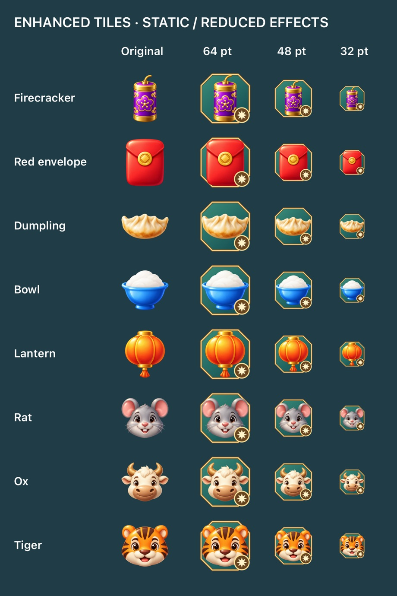

# Enhanced tile treatment

## Decision: option 1 — enhance the existing artwork

An enhanced tile still matches its original type, but clears the eight surrounding cells when activated. Preserve the original object's colors, proportions, silhouette and position, and give every enhanced type the same permanent power marker. This is a recommendation for this game's mechanics, not a claim that every match-three game uses the same rendering technique.

Option 2 (separate illustrated sprites) is better reserved for a power-up with an entirely different identity or silhouette. For these same-type upgrades, it would add a second art set to maintain and keep visually aligned with the base assets. The chosen approach automatically follows future base-art changes and does not add bundled sprite images.

King's [Striped Candy explanation](https://candycrush.zendesk.com/hc/en-us/articles/13939175958941-Learn-all-about-the-Striped-Candy) is a useful example of a recognizable special-piece marking that corresponds to its action. Here the marker is a radial burst, not a directional stripe, because the effect is an area blast. [Game Accessibility Guidelines](https://gameaccessibilityguidelines.com/full-list/) recommend not conveying essential information through color alone and providing control over distracting movement. Accordingly, the enhancement remains visible with motion disabled.

## Implementation

- `EnhancedTileAppearance` composites an octagonal jade-and-gold frame behind the unchanged base artwork, with an eight-point burst seal at the lower right. The shape and seal provide cues beyond color alone.
- `TileArtwork` lazily caches a separate 256 × 256 texture for each enhanced artwork identity. Festival textures are shared across chapters; zodiac variants remain distinct. This adds runtime texture memory, but no second set of bundled PNGs.
- Resting enhanced tiles remain single sprite nodes: no continuous particle emitter, pulsing action, or persistent overlay nodes. Other special pieces' existing effects are unchanged.
- Creation uses a 0.24-second eased scale settle, a fading ring and four brief sparks. The accent is owned by the sprite and removed when the awaited animation finishes. Reduced-motion mode uses a 0.16-second fade without scaling or sparks.
- Both normal special-piece creation and victory bonus enhancement use this treatment. Feedback does not award moves or progress; gameplay rules and victory move accounting are unchanged.
- Selection retains its separate rounded outline. Enhanced status uses an octagonal frame and burst seal, so selection does not replace or erase the power marking.

The game-feel and UI/accessibility skills informed the short, local feedback, permanent readable state, and absence of idle effect loops. Swift concurrency guidance informed main-actor rendering and awaiting animation completion rather than timing tests with sleeps.

## Verification

- 29 XCTest regressions passed, including cache identity, transparent padding, absence of resting nodes/actions, matching compatibility across all zodiac identities, and the eight-neighbor blast rule.
- Live SpriteKit tests await creation feedback in both motion modes and verify final scale, opacity, cleanup and unchanged move count.
- Reviewed a native-rendered comparison at 32, 48 and 64 points; reviewed mixed Rat, Ox and Tiger boards at 375 × 812 and a compact Rat board at 320 × 568, including enhanced selection.
- Debug tests and unsigned Release device build passed. Physical-device frame pacing and hands-on animation feel still require a release-device check; this pass does not claim a measured FPS improvement.
- `enhanced-tile-preview.jpg` is a compressed test-rendered artwork comparison, not a design mockup, and is documentation only (not an app resource).

