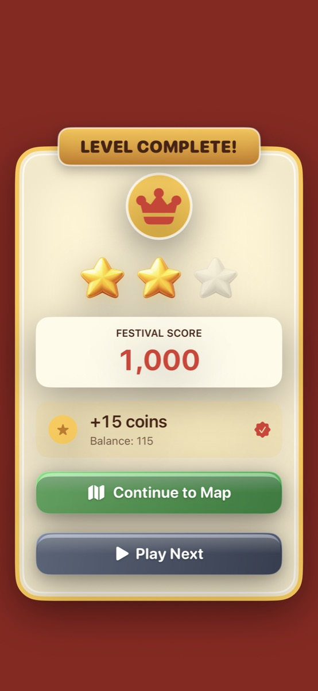

# Gameplay animation and power-up artwork pass

## Changes

- Removed all floating per-chain point labels. Score calculation and HUD score updates are unchanged.
- Added a shared, finite birth sequence for all six enhanced families, the star/universal piece and lightning: gather, brief squash, pop and settle. Reduced effects uses opacity only.
- Replaced the star/lightning idle particle emitters and perpetual pulse/flash with quiet resting artwork. Enhanced pieces keep their permanent frame and blast badge.
- Clear feedback now deduplicates overlapping chain sprites before scheduling actions, awaits actual removal, then removes its entire effects container. Normal matches use a small pop; enhanced blasts add thin area rings; lightning has a thin zigzag trail; star clears tug affected pieces inward briefly. No full-cell white flash or opaque screen-spanning bar.
- Clear batches cap sparks at 64 and enhanced rings at six; haptic impact is emitted once per batch. The board shake is a small smooth, decaying displacement rather than random stepping. These are workload bounds, not a measured FPS claim.
- Refill and falling timings are shorter and bounded. Reduced effects avoids falling motion. Empty refill columns are safe.
- Victory bonus pieces form in a short staggered wave (rather than N consecutive creation animations), with level identity guards before move deductions.
- Winning has a small board settle, spring-revealed illustrated stars and a single finite confetti burst. Losing retains the board as context, uses a soft result entrance and a centered settling emblem. There is no repeated loss shake. Retry/map controls do not wait for effects.
- Loss and win panels scroll on compact/landscape layouts and support larger text. Back to Levels is available even when lives remain.
- Added star and jade lock art, used by board pieces and goal HUD. Two/three-hit locks share the lock artwork with permanent strength pips. Blocker downgrade rendering now uses the scene's cached artwork refresh instead of swapping to emoji from the level model.

## Assets

Generated with the built-in image-generation tool, then normalized using `tools/prepare_tile.swift` and compressed with `pngquant --quality=80-95 --strip`. Both outputs are 256 × 256 RGBA PNGs with transparent padding. Combined compressed size: 36,235 bytes (about 35.4 KiB).

- `SpringFestivalCrush/Assets.xcassets/Sprites/StarTile.imageset/StarTile.png`
- `SpringFestivalCrush/Assets.xcassets/Sprites/LockTile.imageset/LockTile.png`

### Star prompt

Use case: stylized-concept. Asset type: production transparent match-three game power-up sprite for Spring Festival Crush, also used as earned reward stars. Subject: one chunky five-point golden star, polished softly beveled 2.5D painted toy-like gold, warm amber shaded lower-right edge, pale cream broad upper-left highlight, no face. Front-facing orthographic view. Silhouette must be immediately readable at 32 points. Centered on a square canvas with even transparent padding, occupies 80 percent including all points. Same premium casual mobile puzzle art style as sculpted red envelopes, orange lanterns and blue rice bowls. Genuine transparent alpha background; no scene, backdrop, floor, checkerboard, external shadow, glow, particles, text, numbers, watermark, border, medallion or extra objects. Single final game sprite, not a sheet or mockup.

### Lock prompt

Use case: stylized-concept. Asset type: production transparent match-three game blocker sprite for Spring Festival Crush. Subject: one closed chunky padlock, rounded square jade-teal body with a thick polished golden brass rim, a simple gold keyhole at center and a stout arched golden shackle. Friendly premium casual puzzle game style, sculpted toy-like 2.5D painted render, broad upper-left highlights, softly shaded lower-right bevels, clean large shapes and no tiny decoration. Front-facing orthographic view. Centered square canvas, 80 percent occupancy with generous even transparent padding, readable at 32 points. Genuine transparent alpha background, including inside the shackle hole. No scene, backdrop, floor, checkerboard, external shadow, glow, particles, text, numbers, watermark, keys, chains or extra objects. Single final sprite, not a mockup or sprite sheet.

## Design constraints

The game-feel/UI skills guided short local feedback, eased motion, permanent readable power markers, reduced motion and uncluttered result controls. SwiftUI/concurrency guidance informed completion-driven result sequences, main-actor rendering and tests that await native animation completion. No new package or sound dependency was added. No reward values, match rules, ad IDs, lives costs or progression rules were changed.

## Verification

- 33 XCTest regressions passed. Coverage includes all eight power creation paths, six clear kinds, overlapping chains, cleanup/no floating score labels, asset transparency/cache reuse, lock strength transitions, bonus move accounting, refill completion, result reset and exit-during-bonus safety.
- Reviewed actual SpriteKit mid-animation frames for enhanced, lightning and star clears. Existing board rendering tests also cover Rat, Ox and Tiger.
- Reviewed native win/lose snapshots at 320 × 568, 375 × 812 with Accessibility 3 text/reduced effects, and 812 × 375 dark landscape. Native scrolling tests and bottom-of-panel screenshots confirm that the result buttons remain reachable. Reviewed blank final confetti output to confirm the burst leaves no decoration behind.
- Debug tests, unsigned Release device build, project validation and `git diff --check` passed.
- `victory-animation-preview.jpg` is a compressed native screenshot of the settled result screen, not an animation recording or design mockup.
- Physical-device frame pacing, touch/swipe feel, audio and haptics still require release-device QA. This pass does not claim a measured FPS improvement or hands-on device playthrough. No production ads were requested.

